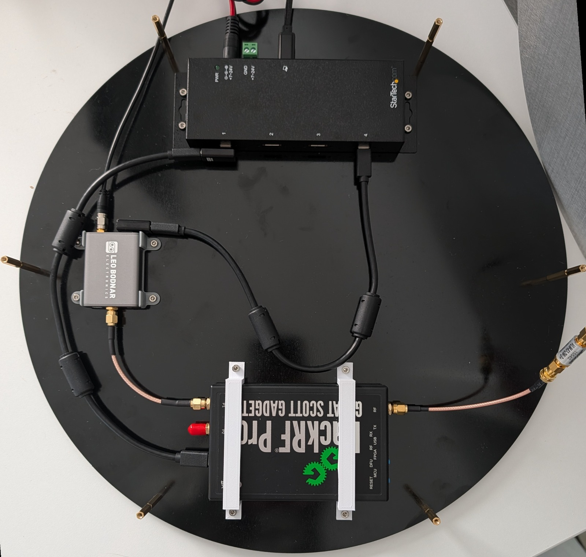
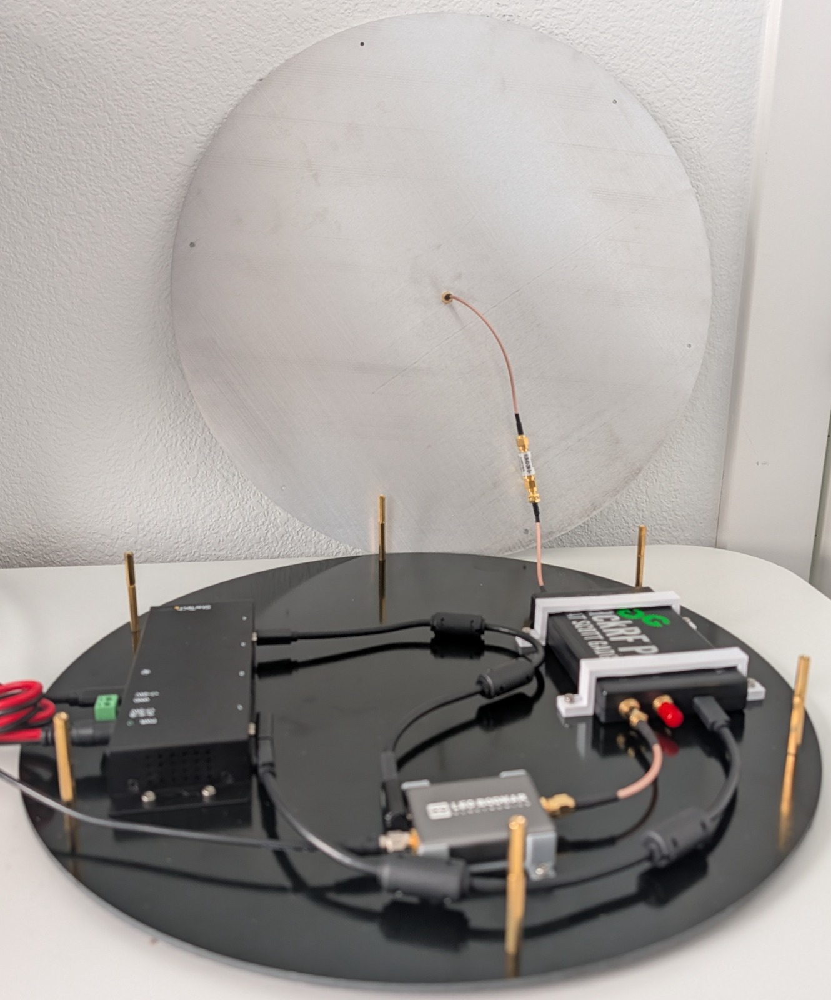
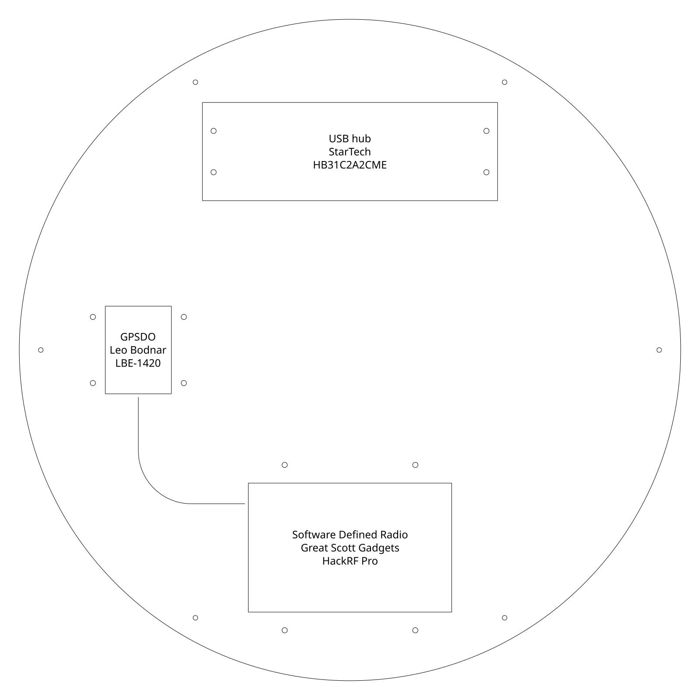
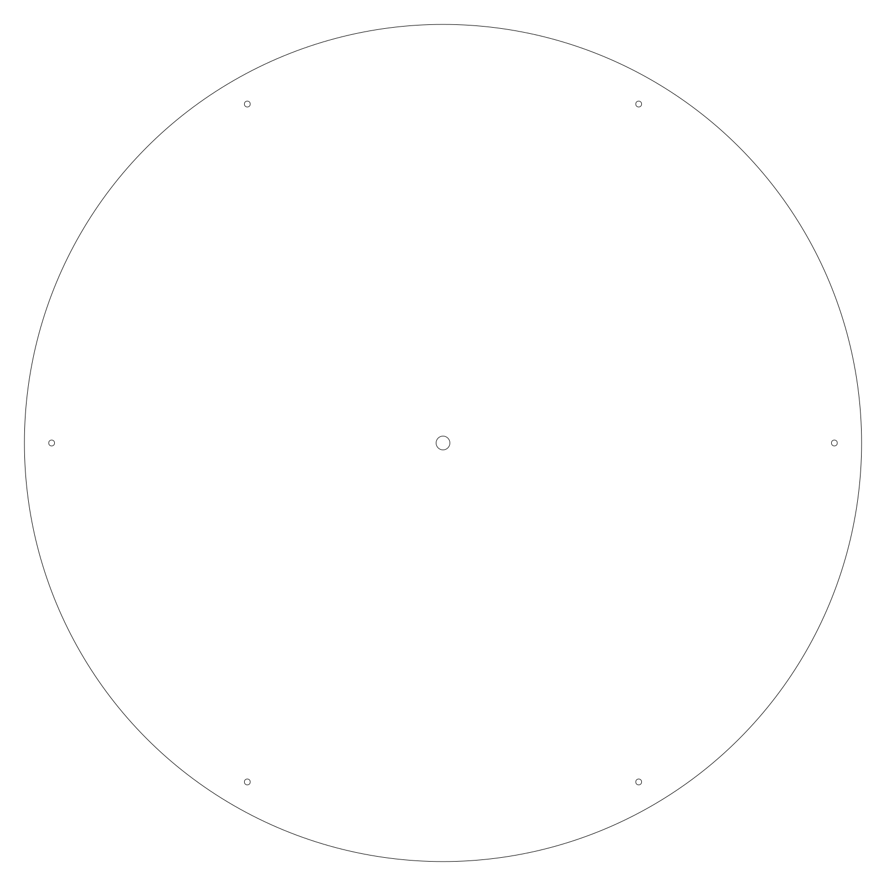
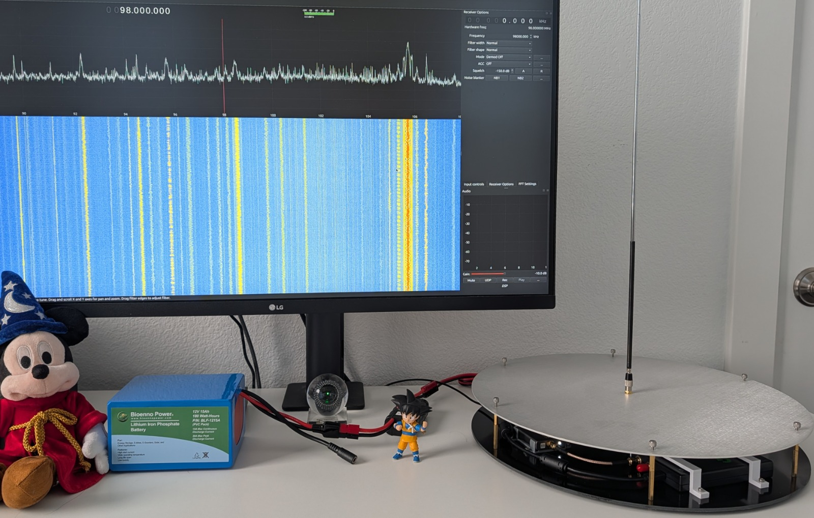

# RF Listening Station

A high-performance radio receiver system based on the HackRF Pro, designed for stable, sensitive RF signal reception. This build combines precision clock synchronization, RF protection, and a portable form factor for reliable spectrum monitoring and analysis.

## Overview

This listening station delivers professional-grade performance through careful component selection and proper RF shielding. The core features include:

- **HackRF Pro** receiver for wideband signal reception (30 MHz - 6 GHz)
- **GPS-disciplined oscillator (GPSDO)** for frequency accuracy and stability
- **RF protection** via a limiter and attenuators for handling high-power signals
- **Battery-powered** operation for portable deployment
- **Compact mechanical design** using precision-machined discs and 3D-printed mounts

---

## Photos

| Top view | Side view |
|----------|-----------|
|  |  |

---

## Bill of Materials

### Radio Frequency Hardware

| Component | Part Number | Purpose |
|-----------|-------------|---------|
| [HackRF Pro](https://greatscottgadgets.com/hackrf/pro/) | - | Wideband SDR receiver |
| [Mini-Circuits 6GHz Limiter](https://www.minicircuits.com/WebStore/dashboard.html?model=VLM-63-2W-S%2B) | VLM-63-2W-S+ | RF signal clipping & ESD protection |
| [Mini-Circuits DC to 6 GHz Attenuator](https://www.minicircuits.com/WebStore/dashboard.html?model=K1-VAT-A%2B) | K1-VAT-A+ | Input attenuation for high-power signals |
| [Double-shielded RG316D coax pigtail](https://www.ebay.com/itm/145242622653) | 10cm, SMA-M to SMA-M | Connects GPSDO to HackRF CLKIN |
| [Shielded M-F RG316 coax pigtail](https://www.amazon.com/dp/B091TH6CCJ?th=1) | 15cm, B091TH6CCJ | SMA bulkhead for the ground plane and HackRF |
| [SMA-M telescopic antenna](https://greatscottgadgets.com/ant500/) | ANT500 | Atatches to SMA bulkhead |

Also check out [Signal Stick SMA-M](https://signalstuff.com/products/st-sma-m/) antennas for easy access to HAM bands.

### Clock & Timing

| Component | Description |
|-----------|-------------|
| [Leo Bodnar LBE-1420 GPSDO](https://www.leobodnar.com/shop/index.php?main_page=product_info&products_id=393) | GPS-disciplined reference clock |
| [Leo Bodnar LBE-0006 Bracket](https://www.leobodnar.com/shop/index.php?main_page=product_info&products_id=402) | Mounting bracket for GPSDO |

### Power & USB

| Component | Specification | Purpose |
|-----------|---------------|---------|
| [Bioenno Power Battery](https://www.bioennopower.com/products/12v-3ah-lifepo4-battery-pvc?_pos=2&_fid=890042680&_ss=c) | BLF-1203AB 12V 3Ah LiFePO4 | Clean DC power supply (8-10 hour runtime) |
| [DC Power Cable](https://www.amazon.com/dp/B0CW2MTHKS?th=1) | 5.5mm × 2.1mm male | Battery to hub connector |
| [StarTech USB C Hub](https://www.startech.com/en-us/usb-hubs/hb31c2a2cme) | 4-port, 10Gbps | Industrial low-EMI USB hub |
| [Digirig Shielded USB Cables](https://digirig.net/product/short-usb-a-to-usb-c-cable/) | Shielded and RF choked | High-quality USB 2.0 connectivity |

**Note:** You will need an Anderson Powerpole crimper and terminator kit to complete the DC power cable.

### Mechanical Components

#### Base Assembly (two discs, each 20cm radius)

| Component | Material & Spec | Purpose | Preview |
|-----------|-----------------|---------|---------|
| [Base plate](assembly/base_plate.dxf) | FR-4 G10 Black fiberglass, 0.125" | Primary mounting surface |  |
| [Ground plane](assembly/ground_plane.dxf) | 5052 H32 Aluminum, 0.080" | RF shielding and counterpoise |  |

The linked manufacturing files above are suitable for direct upload to [SendCutSend](https://sendcutsend.com/) or equivalent.

> **V2 base plate:** We finally received the correct V2 base plate with the holes properly placed. The initial version had wrong hole placement, so we had to re-measure and produce an updated plate with correct mounting hole dimensions. We're happy to have finally landed on a design that mounts all devices in exactly the right positions.

The base plate features through holes for mounting the following components:
- South position: HackRF (using 3D-printed brackets)
- West position: GPSDO (using the LBE-006 bracket, older variant)
- North position: USB hub

The DXF files are licensed under [CC BY 4.0](https://creativecommons.org/licenses/by/4.0/).

The base plate DXF file in this repository contains three layers:
- Layer 0: The circular outline plus mounting holes: M2.5 outer for standoffs and M3 inner for devices
- Layer 1: Outlines of the electronics to be mounted (HackRF, GPSDO, USB hub)
- Layer 2: Path for the 10cm RG316D clock signal cable

Prior to manufacturing, remove layers 1 and 2 from the base plate DXF file.

Note: Leo Bodnar has two variants of the LBE-006 bracket. The base plate DXF is designed for the older variant. When ordering the LBE-006 from Leo Bodnar, specifically request the older variant. If it's no longer available, either 3D print using the provided STL file or modify the mounting holes to match the newer bracket's requirements (M3 holes spaced 20mm [X-axis] by 30mm [Y-axis] center-to-center).

#### Fasteners & Mounts

| Type | Specification | Quantity | Application |
|------|---------------|----------|-------------|
| M3-0.5 machine screws | 10mm | 4 | HackRF mounting brackets |
| M3-0.5 machine screws | 7mm | 4 | GPSDO mounting bracket |
| M3-0.5 Hex Nuts | DIN 439B thin | 8 | Secure machine screws for HackRF & GPSDO |
| M2.5-0.5 thumb screws | 8mm | 6 per disc (12 total) | Attach outer plate standoffs |
| M2.5-0.5 F-F standoffs | 20mm | 6 | Plate spacers |
| M2.5-0.5 M-F standoffs | 30mm | 6 | Plate spacers |

#### 3D Printed Parts

For the HackRF:
- [Mount, source](https://www.thingiverse.com/thing:3019950) (original design)
- [Mount, 1.0mm shorter](assembly/hackrf_mount_79mm_h-1.0.stl) (final design selection)
- [Mount, 1.5mm shorter](assembly/hackrf_mount_79mm_h-1.5.stl) (may also work)

The modified HackRF mount designs are all licensed under [CC4.0](https://creativecommons.org/licenses/by/4.0/).

Leo Bodnar has kindly given permission to host the [STEP file](assembly/0006%20wide%20mounting%20base.step) for the LBE-006 used in this project.
A tesselated STL variant, used for 3D printing, is available [here](assembly/0006%20wide%20mounting%20base.stl).

---

## Design Rationale

### Why LiFePO4 Battery Power?

- **Clean DC output with minimal ripple** - Essential for clock stability and receiver noise floor
- **AC noise isolation** - Wall adapters inject switching noise that degrades both the GPSDO accuracy and HackRF receiver performance
- **Portable operation** - 3Ah capacity provides 8-10 hours of continuous operation
- **Compact footprint** - Fits on the base plate without external enclosure

### Why RF Limiter?

- **30 MHz - 6 GHz coverage** with only 0.4 dB insertion loss
- **11.5 dB RF signal clamping** protects the HackRF frontend from damage
- **ESD protection** guards against static discharge during field use
- **Readily available** through DigiKey in the US

### Why Attenuators?

- **Dynamic range extension** - Allows safe reception of high-power signals that would exceed HackRF input limits
- **Prevents compression & damage** - Protects sensitive receiver stages
- **Configurable attenuation** - Adjust input levels based on signal environment
- **US availability** via DigiKey

### Why GPS-Disciplined Oscillator?

- **Frequency accuracy** - ±0.05 ppm from satellite references
- **Clock stability** - Essential for coherent signal analysis and tuning precision
- **Wideband receiver optimization** - Improves image rejection and phase noise characteristics

The HackRF Pro ships with a built-in TCXO that's decent for casual use, but it still drifts - typically a few ppm over temperature changes and time. At higher frequencies that drift gets multiplied: even 1 ppm of error at 1 GHz means you're off by 1 kHz, which is enough to smear a narrowband signal right out of your passband. For wideband scanning that might not matter much, but the moment you're trying to do anything precise - demodulating a narrowband FM signal, characterizing a filter's passband edges, or comparing signals across sessions - that drift becomes the limiting factor. The GPSDO locks the HackRF's sample clock to GPS-disciplined cesium references, pushing accuracy down to parts-per-billion and eliminating drift as a variable entirely. It turns the HackRF from a "good enough" receiver into a calibrated instrument.

To see the difference yourself, tune GQRX to a known stable signal - a local NOAA weather broadcast or an AM carrier works well. With the HackRF running on its internal oscillator, watch the waterfall over 15-20 minutes as the board warms up. You'll see the signal trace slowly wander left or right as the internal clock drifts, sometimes shifting by several hundred hertz. Now connect the GPSDO to CLKIN and restart GQRX. That same signal will pin to a single column in the waterfall and stay there indefinitely - no wander, no drift, just a rock-solid line. The visual difference is immediate and striking: a meandering smear versus a razor-sharp trace.

---

## Assembly

The base plate has two sets of mounting holes: outer M2.5 holes for the standoffs that support the ground plane, and inner M3 holes for mounting the electronics.

1. Attach 6x M2.5 standoffs to the outer holes of the base plate using M2.5 thumb screws. These standoffs hold the ground plane above the base plate. Recommended total standoff height: 50mm.
2. Insert the female bulkhead of the M-F RG316 coax into the center hole of the ground plane and tighten its mounting bolt.
3. Mount the HackRF in the south device position using the 3D-printed brackets and 4x M3×10mm machine screws with hex nuts.
4. Mount the GPSDO bracket in the west device position using 4x M3×7mm machine screws, then insert the GPSDO.
5. Secure the StarTech USB hub in the north device position using its dedicated mounting holes.
6. Connect the HackRF RF port to the limiter with an M-F RG316 coax.
7. Connect the limiter output to the ground plane bulkhead coax.
8. Connect the GPSDO to the HackRF CLKIN port using the 10cm M-M RG316D coax, then attach the GPSDO antenna.
9. Align the ground plane with the M2.5 standoffs and secure it using 6x M2.5 thumb screws.

---

## Next Steps

With the build complete, we are finally ready to scan the wireless spectrum from 30 MHz to 6 GHz with a 20 MHz instantaneous bandwidth. Our immediate challenge is capturing signals from household remotes as a first step toward building a home automation system. The tricky part is that many of these devices operate in the crowded 2.4 GHz ISM band, so filtering out the noise will be the main hurdle. We'll continue exploring techniques to isolate and decode those signals as the project moves forward.
